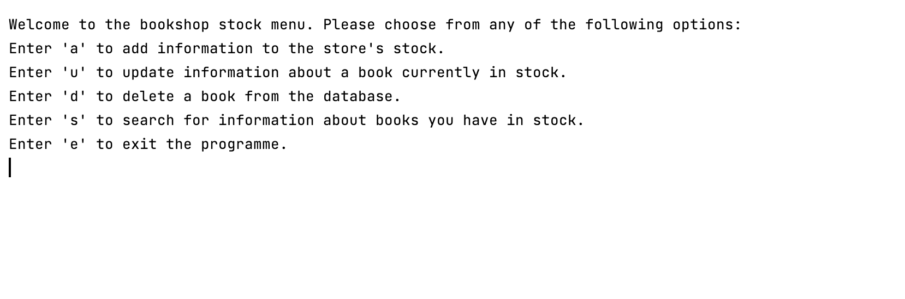

# Bookshop-Backend 
## The project name.

○ This project is the backend logic, written in Python, for a hypothetical bookshop. 
It allows users to add, remove, update, and search for books.

> 100% score! - Hyperion Dev Reviewers
* I wrote this in _Markdown_ __because I wanted you to have an enjoyable reading experience.__ 

○ The rest of this README file is going to tell you how to install the project onto your computer 
and how to deploy it.

### How to install
1. Download the code from Github and paste to a Python IDE or clone it:
> git clone https://github.com/ThomasAlberto/Bookshop-Backend.git
2. Delete any pre-existing SQL database data.
3. Run the programme.

○ More detail on step 2:

_If you see the following display, it means you have a database 
called "bookshop" and the programme is trying to make a new database
of the same name. You have to manually delete the old database before 
proceeding._

_Once you do that, your terminal should look like this after 
running the programme:_

### Credits:
* The kind reviewers of HyperionDev.
